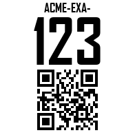

# Havoc-QR-Label-Generator

Generates printable QR code identification plates for drone assets. Each plate encodes the drone's local network address as a QR code so ground crew can pull up its web interface instantly with a phone camera — no app required.

---

## What a plate looks like



The plate above was generated for asset **ACME-EXA-123**. Every plate is a square image composed of three layers, top to bottom:

| Layer | Content | Purpose |
|-------|---------|---------|
| **Header** | Fleet prefix in small caps — e.g. `ACME-EXA-` | Identifies the asset at a glance |
| **Number** | Large asset number — e.g. `123` | Human-readable ID, visible from a distance |
| **QR code** | Encoded URL — e.g. `http://acme-exa-123:8000/` | Scannable link to the drone's onboard web UI |

The QR code URL follows the pattern `http://<prefix><number>:8000/`, where the prefix is lowercased and the number matches the label. This means a phone scan takes ground crew directly to that specific drone's dashboard over the local network.

---

## Web GUI (GitHub Pages)

A browser-based version of this tool lives in [`docs/`](docs/) — no install
required, and nothing is uploaded anywhere: QR encoding, label rendering, and
PNG/ZIP/PDF export all run client-side.

**Features**

- Live preview of every label in the batch (click any preview to download that PNG)
- Multiple label layouts: **Vertical badge** (classic plate), **Horizontal tag**
  (QR left, text right), and **QR only** — new layouts can be added by
  registering an entry in [`docs/layouts.js`](docs/layouts.js)
- **Download PDF** — one label per page, pages sized to the exact physical
  dimensions for true-scale printing
- **Download PNGs (ZIP)** — one PNG per label, with embedded DPI metadata so
  they print at physical size
- **Copy share link** — encodes the current settings in the URL so a teammate
  opens the exact same configuration

**Hosting on GitHub Pages**

1. Push this repo to GitHub.
2. In the repo: *Settings → Pages → Build and deployment → Source:
   "Deploy from a branch"*, branch `main`, folder `/docs`.
3. Share the resulting `https://<org>.github.io/<repo>/` URL.

**Running locally** (any static file server works):

```bash
python -m http.server 8000 --directory docs
```

---

## Setup

```bash
pip install -r requirements.txt
```

The font file `AGENCYB.TTF` (Agency FB Bold) must be present in the project root. It ships with this repo.

---

## Generating plates

Open `generate_labels.py` and edit the **CONFIG** block at the top:

```python
LABEL_PREFIX = "ACME-EXA-"   # fleet/site prefix — appears on header and in the URL hostname
NUMBER_START = 601            # first asset number (inclusive)
NUMBER_END   = 650            # last asset number (inclusive)
```

Then run:

```bash
python generate_labels.py
```

Images are written to the `output/` folder, one file per asset:

```
output/
  acme-exa-601.png
  acme-exa-602.png
  ...
  acme-exa-650.png
```

---

## Configuration reference

All tuneable values live in the CONFIG block. No code changes are needed for routine batch runs.

| Variable | Default | Description |
|----------|---------|-------------|
| `LABEL_PREFIX` | `"ACME-EXA-"` | Fleet/site prefix. Used in the header text, filename, and QR URL. |
| `NUMBER_START` | `601` | First asset number to generate (inclusive). |
| `NUMBER_END` | `603` | Last asset number to generate (inclusive). |
| `URL_TEMPLATE` | `http://{prefix}{i}:8000/` | URL encoded in the QR code. `{prefix}` is the lowercased prefix; `{i}` is the number. |
| `PLATE_MM` | `52` | Physical plate size in millimetres (square). Match to your label stock. |
| `DPI` | `96` | Output resolution. Increase for higher-quality prints (e.g. `300` for professional printing). |
| `FONT_SIZE_SMALL` | `18` | Header text size in points. |
| `FONT_SIZE_LARGE` | `90` | Asset number text size in points. |
| `QR_HEIGHT_FRACTION` | `0.45` | QR code height as a fraction of the plate height. |

---

## Output folder

The `output/` folder is intentionally excluded from the example image used in this README. The sample plate at `docs/acme-exa-123.png` is a committed reference — do not delete it. Generated plates in `output/` are disposable and can be regenerated at any time.
